# 数据库概述

## RDBMS与非RDBMS

### 关系型数据库(RDBMS)

#### 实质

- 这种类型的数据库是的数据库类型，关系型数据库模型是把复杂的数据结构归结为简单的(即二维表格形式)。

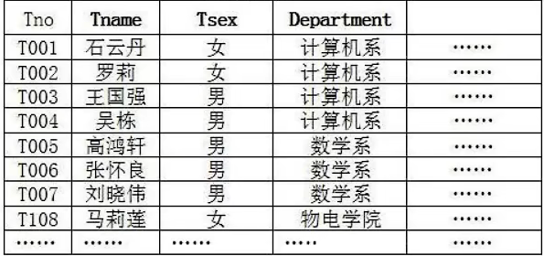

- 关系型数据库以和的形式存储数据，以便于用户理解。这一系列的行和列被称为，一组表组成了一个库(database)。
- 表与表之间的数据记录有关系(relationship)。现实世界中的各种实体以及实体之间的各种联系均用来表示。关系型数据库，就是建立在基础上的数据库。
- SOL就是关系型数据库的查询语言。

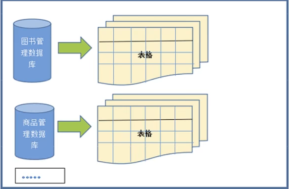

#### 优势

- 复杂查询

  可以用SQL语句方便的在一个表以及多个表之间做非常复杂的数据查询。。

- 事务支持

  使得对于安全性能很高的数据访问要求得以实现。

### 非关系型数据库(非RDBMS)

#### 介绍

非关系型数据库，可看成传统关系型数据库的功能，基于键值对存储数据，不需要经过SQL层的解析，。同时，通过减少不常用的功能，进一步提高性能。

目前基本上大部分主流的非关系型数据库都是免费的。

#### 有哪些非关系型数据库

相比于SQL，NoSQL泛指非关系型数据库，包括了榜单上的键值型数据库、文档型数据库、搜索引擎和列存储等，除此以外还包括图形数据库。也只有用NoSQL一词才能将这些技术囊括进来。

- 键值型数据库

  键值型数据库通过Key-Value键值的方式来存储数据，其中Key和Value可以是简单的对象，也可以是复杂的对象。Key作为唯一的标识符，优点是查找速度快，在这方面明显优于关系型数据库，缺点是无法像关系型数据库一样使用条件过滤（比如WHERE)，如果你不知道去哪里找数据，就要遍历所有的键，这就会消耗大量的计算。

  键值型数据库典型的使用场景是作为。是最流行的键值型数据库。

  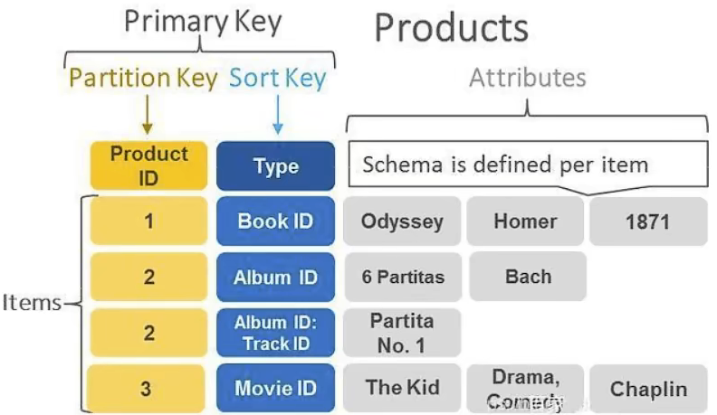

  

- 文档型数据库

  此类数据库可存放并获取文档，可以是XML、JSON等格式。在数据库中文档作为处理信息的基本单位，一个文档就相当于一条记录。文档数据库所存放的文档，就相当于键值数据库所存放的“值"。MongoDB是最流行的文档型数据库。此外，还有CouchDB等。

- 搜索引擎数据库

  虽然关系型数据库采用了索引提升检索效率，但是针对全文索引效率却较低。搜索引擎数据库是应用在搜索引擎领域的数据存储形式，由于搜索引擎会爬取大量的数据，并以特定的格式进行存储，这样在检索的时候才能保证性能最优。核心原理是“倒排索引”。

  典型产品: Solr、Elasticsearch、Splunk 等。

- 列式数据库

  列式数据库是相对于行式存储的数据库，Oracle、MySQL、sQL Server等数据库都是采用的行式存储（Row-based)，而列式数据库是将数据按照列存储到数据库中，这样做的好处是可以大量降低系统的V/O，适合于分布式文件系统，不足在于功能相对有限。典型产品:HBase等。

  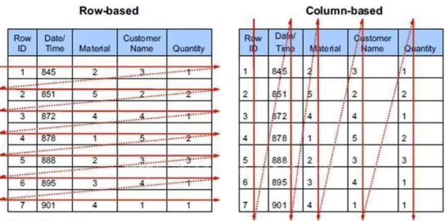

- 图形数据库

  图形数据库顾名思义，就是一种存储图形关系的数据库。它利用了图这种数据结构存储了实体(对象）之间的关系。关系型数据用于存储明确关系的数据，但对于复杂关系的数据存储却有些力不从心。如社交网络中人物之间的关系，如果用关系型数据库则非常复杂，用图形数据库将非常简单。典型产品:Neo4J、InfoGrid等。

  

  

## 关系型数据库设计规则

- 关系型数据库的典型数据结构就是，这些数据表的组成都是结构化的(Structured)。
- 将数据放到表中，表再放到库中。
- 一个数据库中可以有多个表，每个表都有一个名字，用来标识自己。表名具有唯一性。
- 表具有一些特性，这些特性定义了数据在表中如何存储，类似Java和Python中“类”的设计。

### 表、记录、字段

- E-R (entity-relationship，实体-联系）模型中有三个主要概念是:。
- 一个实体集(class）对应于数据库中的一个表(table)，一个实体 （(instance)则对应于数据库表中的一行(row)，也称为一条记录（record)。一个属性(attribute)对应于数据库表中的一列(column)，也称为一个字段(field) 。

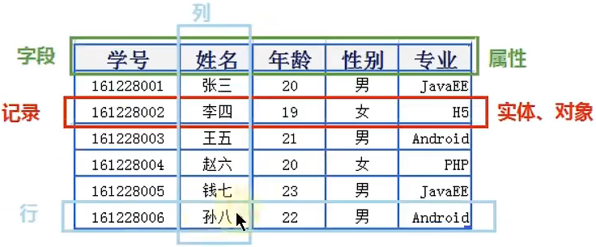

### 表的关联关系

- 表与表之间的数据记录有关系(relationship)。现实世界中的各种实体以及实体之间的各种联系均用关系模型来表示。
- 四种:一对一关联、一对多关联、多对多关联、自我引用

#### 一对一关联(one-to-one)

- 在实际的开发中应用不多，因为一对一可以创建成一张表。
- 举例:设计∶学号、姓名、手机号码、班级、系别、身份证号码、家庭住址、籍贯、紧急联系人、...
  - 拆为两个表:两个表的记录是一一对应关系。
  - （常用信息)︰学号、姓名、手机号码、班级、系别
  - （不常用信息)︰学号、身份证号码、家庭住址、籍贯、紧急联系人、...
- 两种建表原则:
  - 外键唯一:主表的主键和从表的外键（唯一)，形成主外键关系，外键唯一。
  - 外键是主键:主表的主键和从表的主键，形成主外键关系。

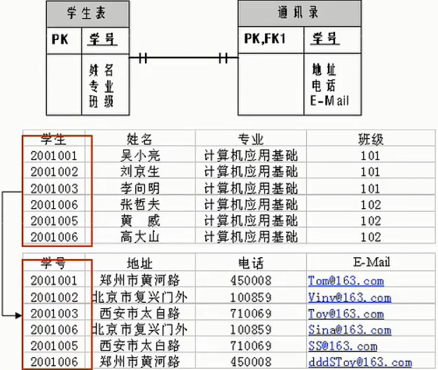

#### 一对多关系(one-to-many)

- 常见实例场景: ，，。
- 举例:
  - 员工表:编号、姓名、..、所属部门。
  - 部门表:编号、名称、简介
- 一对多建表原则:在从表(多方)创建一个字段，字段作为外键指向.

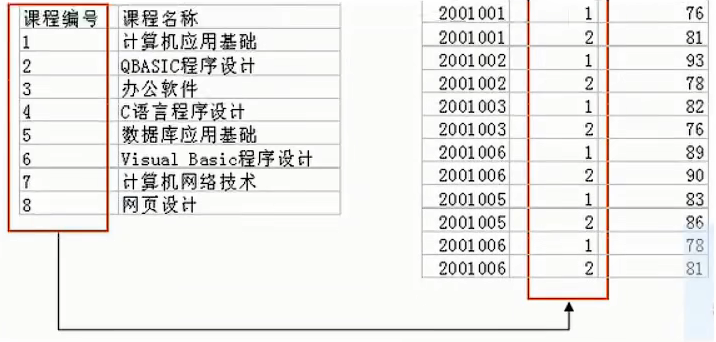

#### 多对多(many-to-many)

要表示多对多关系，必须创建，该表通常称为，它将多对多关系划分为两个一对多关系。将这两个表的主键都插入到第三个表中。

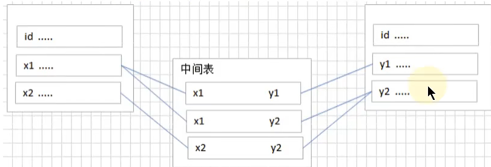

- 举例1:学生-课程

  - 学生信息表:一行代表一个学生的信息（(学号、姓名、手机号码、班级、系别...)。

  - 课程信息表:一行代表一个课程的信息（课程编号、授课老师、简介..)

  - 选课信息表:一个学生可以选多门课，一门课可以被多个学生选择

    ```
    学号	课程编号
     1	  1001
     2	  1001
     1	  1002
    ```

- 举例2:产品-订单

  “订单"表和“产品"表有一种多对多的关系，这种关系是通过与“订单明细"表建立两个一对多关系来定义的。一个订单可以有多个产品，每个产品可以出现在多个订单中。

  - 产品表:“产品”表中的每条记录表示一个产品。
  - 订单表:“订单”表中的每条记录表示一个订单。
  - 订单明细表∶每个产品可以与“订单"表中的多条记录对应，即出现在多个订单中。一个订单可以与“产品”表中的多条记录对应，即包含多个产品。

  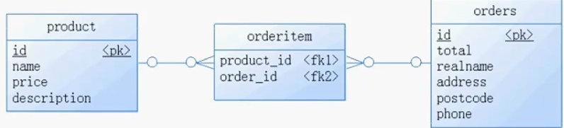

#### 自我引用

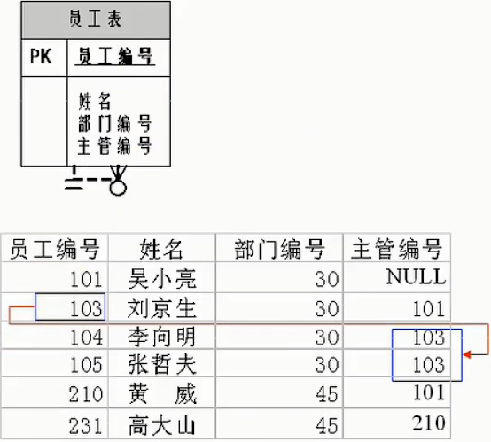


# MySQL使用

## MySQL演示

1. 查看所有的数据库

   ```MySQL
    show databases;
   ```

   

   “information_schema”是MySQL系统自带的数据库，主要保存MySQL数据库服务器的系统信息，比如数据库的名称、数据表的名称、字段名称、存取权限、数据文件所在的文件夹和系统使用的文件夹，等等

   “performance_schema”是MySQL系统自带的数据库，可以用来监控MySQL的各类性能指标。

   “sys"数据库是MysQL系统自带的数据库，主要作用是以一种更容易被理解的方式展示MySQL数据库服务器的各类性能指标，帮助系统管理员和开发人员监控MySQL的技术性能。

   “mysql"数据库保存了MySQL数据库服务器运行时需要的系统信息，比如数据文件夹、当前使用的字符集、约束检查信息，等等

   

2. 创建自己的数据库

   ```MySQL
   create database数据库名;
   
   #创建atguigudb数据库，该名称不能与已经存在的数据库重名。
   create database atguigudb;
   ```

3. 使用目己的数据库

   ```MySQL
   use数据库名;
   #使用atguigudb数据库
   use atguigudb;
   ```

   说明:如果没有使用use语句，后面针对数据库的操作也没有加“数据名"的限定，那么会报“ERROR 1046(3Do0o);No database selected”(没有选择数据库)

   使用完use语句之后，如果接下来的SQL都是针对一个数据库操作的，那就不用重复use了，如果要针对另一个数据库操作，那么要重新use。

4. 查看某个库的所有表格

   ```MySQL
   show tables;#要求前面有use语句
   show tables from数据库名;
   ```

5. 创建新的表格

   ```MySQL
   create table 表名称(
   	字段名 数据类型，
    	字段名数据类型
   );
   ```

   说明:如果是最后一个字段，后面就用加逗号，因为逗号的作用是分割每个字段。

   ```MySQL
   #创建学生表
   create table student(
   	id int,
   	name varchar(20)	#说名字最长不超过20个字符
   );
   ```

6. 查看一个表的数据

   ```MySQL
   select * from数据库表名称;
   
   #查看学生表的数据
   
   select * from student ;
   ```

7. 添加一条记录

   ```MySQL
   insert into表名称values(值列表);
   #添加两条记录到student表中
   insert into student values ( 1, '张三');
   insert into student values(2,'李四');
   ```

   报错:

   ```MySQL
   mysql> insert into student values ( 1,'张三');
   ERROR 1366 (HY800 ) : Incorrect string value: ' lxD5\xC5\xC8\xFD' for column 'name' at row 1
   mysql> insert into student values(2,'李四');
   ERROR 1366 (HYe00): Incorrect string value: 'lxCBlxEE\xCB\xC4' for column 'name' at row 1
   
   mysql> show create table student;
   ```

   字符集的问题。

8. 查看表的创建信息

   ```MySQL
   show creat table 表名称;
   #查看student表的详细创建信息
   show create table student;	
   ```

   ```MySQL
   #结果如下
   | Table     | Create Table
   | employees | CREATE TABLE `employees` (
     `id` int(11) DEFAULT NULL,
     `name` varchar(15) DEFAULT NULL
   ) ENGINE=InnoDB DEFAULT CHARSET=latin1 |
   ```

   上面的结果显示student的表格的默认字符集是“latin1”不支持中文。

9. 查看数据库的创建信息

   ```MySQL
   show create database数据库名;
   #查看atguigudb数据库的详细创建信息
   show create database atguigudb;
   ```

   ```MySQL
   #结果如下
   ***************************1. row *[************火********
   Database : atguigudb
   Create Database: CREATE DATABASE ‘atguigudb`/*!40100 DEFAULT CHARACTER SET latin1 */
   1 row in set (0.00 sec)
   ```

   上面的结果显示atguigudb数据库也不支持中文，字符集默认是latin1。

10. 删除表格

    ```MySQL
    drop table 表名称;
    #删除学生表
    drop table student ;
    ```

11. 删除数据库

    ```MySQL
    drop database 数据库名;
    #删除atguigudb数据库
    drop database atguigudb ;
    ```

## MySQL的编码设置

### MySQL5.7中

问题再现:命令行操作sql乱码问题

```MySQL
mysql>INSERT INTO t_stu VALUES( 1， '张三'，'男');
ERROR 1366 (HY008 ): Incorrect string value: ' lxD51xC51xC8\xFD’ for column 'sname' at row 1
```

问题解决

步骤1:查看编码命令

```MySQL
show variables like 'character_%';
show variables like 'collation_%';
```

步骤2:修改mysql的数据目录下的my.ini配置文件

```MySQL
[mysql] # 在63行左右在其下面添加
default-character-set=utf8;

[mysqld] # 在76行左右在其下面添加
character-set-server=utf8;
collation-server=utf8_general_ci;
```

步骤三：重启服务

步骤四：查看编码命令

## MySQL8.0登录问题

更改加密规则

```MySQL
USE mysql;

# 修改root localhost用户的密码和加载规则
ALTER USER 'root'@'localhost' IDENTIFIED WITH mysql_native_password BY 'admin';

# 刷新权限
FLUSH PRIVILEGES;
```

更改密码

1. 通过服务管理，关掉mysql（服务进程）

2. 通过命令行+特殊指令开启mysql

   ```XML
   mysqld --defaults-file="H:\MySQL\MySQL 8.0\MySQL Server Data 8.0\my.ini" --skip-grant-tables
   ```

3. 此时mysql进程已经打开，并且不需要权限检查

4. mysql -uroot 无密码登录服务器，另一个客服端进行

5. 修改权限表

   ```MySQL
   use mysql;
   update user set authentication_string=password('新密码') where user='root'and Host='localhost';
   flush privileges;
   ```

6. 通过任务管理器关掉mysqld进程

7. 通过进程管理器打开mysql进程

8. 即可用修改后的新密码从新登录

# 基本的SELECT语句

## SQL分类

SQL语言在功能上主要分为如下3大类:

-  ，这些语句定义了不同的数据库、表、视图、索引等数据库对象，还可以用来创建、删除、修改数据库和数据表的结构。
  - 主要的语句关键字包括等。
- ，用于添加、删除、更新和查询数据库记录，并检查数据完整性。
  - 主要的语句关键字包括等。
  - 。
- ，用于定义数据库、表、字段、用户的访问权限和安全级别
  - 主要的语句关键字包括等。



因为查询语句使用的非常的频繁，所以很多人把查询语句单拎出来一类: DQL(数据查询语言)。

还有单独将取出来称为TCL (Transaction Control Language，事务控制语言)。



## SQL语言的规则和规范

### 基本规则

- SQL可以写在一行或者多行。为了提高可读性，各子句分行写，必要时使用缩进。
- 每条命令以;或\g或\G结束
- 关键字不能被缩写也不能分行。
- 关于标点符号
  - 必须保证所有的()、单引号、双引号是成对结束的。
  - 必须使用英文状态下的半角输入方式
  - 字符串型和日期时间类型的数据可以使用单引号('')表示。
  - 列的别名，尽量使用双引号("")，而且不建议省略as

### SQL大小写规范

- MySQL在windows 环境下是大小写不敏感的
- MysQL在Linux环境下是大小写敏感的
  - 数据库名、表名、表的别名、变量名是严格区分大小写的
  - 关键字、函数名、列名(或字段名)、列的别名(字段的别名)是忽略大小写的。
- 推荐采用统一的书写规范:
  - 数据库名、表名、表别名、字段名、字段别名等都小写
  - SQL关键字、函数名、绑定变量等都大写

### SQL导入规则

方式一

```MySQL
source 文件的全路径名
```

方式二

```MySQL
可以使用图形化界面的操作进行导入
```

### 命名规则

1. 数据库、表名不得超过30个字符，变量名限制为29个
2. 必须只能包含A-Z, a-z,0-9，共63个字符
3. 数据库名、表名、字段名等对象名中间不要包含空格
4. 同一个MysQL软件中，数据库不能同名;同一个库中，表不能重名;同一个表中，字段不能重名
5. 必须保证你的字段没有和保留字、数据库系统或常用方法冲突。如果坚持使用，请在sQL语句中使用`(着重号)引起来
6. 保持字段名和类型的一致性，在命名字段并为其指定数据类型的时候一定要保证一致性。假如数据类型在一个表里是整数，那在另一个表里可就别变成字符型了


## 最基本的SELECT语句

### SELECT...

1. SELECT 字段1， 字段2，

   ```MySQL
   SELECT 1+1,3*2;
   ```

### SELECT...FROM

1. SELECT.... FROM 表名

   ```MySQL
   SELECT 1+1,3*2 
   FROM DUAL; # dual 是伪表
   ```

   

2. *：表中的所有字段

   ```MySQL
   SELECT * FROM employees;
   ```

   

3. 具体的字段可以代替*

   ```MySQL
   SELECT employee_id, last_name
   FROM employees;
   ```

### 列的别名

1. 空格 + 别名

   ```MySQL
   SELECT employee_id emp_id
   FROM employees;
   ```

   其中emp_id就是employee_id的别名

2. 使用as，as全称：Alias(别名 )

   ```MySQL
   SELECT employee_id as emp_id
   FROM employees;
   ```

3. 使用双引号引起来，为了方式别名中有空格，等特殊字符

   ```MySQL
   SELECT employee_id "emp id"
   FROM employees;
   ```

### 列的去重

```MySQL
# 没有去重的员工ID
SELECT department_id 
FROM employees;

# 去重过后的员工ID
SELECT DISTINCT department_id
FROM employees;
```

### 空值参与运算

1. 空值：null
2. null不等同于0，'', 'null'

```MySQL
# NULL 参与运算的话，最后结果也为null
SELECT employee_id, salary "月工资", salary * (1 + commission_pct) *12 "年工资", commission_pct
FROM employees;

# 使用IFNULL来空值NULL，如果这个值是null的话就使用后面的数据代替
SELECT employee_id, salary "月工资", salary * (1 + IFNULL(commission_pct,0)) *12 "年工资", commission_pct
FROM employees;
```


### 着重号``

当我们出现表名和MySQL中的特殊字名重复的时候，我们需要使用着重号来进行使用

```MySQL
# 错误示范，ORDER是关键字
SELECT * FROM ORDER;
# 正确示范，使用``将关键字引起来 
SELECT * FROM `order`;
```

### 查询常数

```MySQL
SELECT '尚硅谷' AS '公司', employee_id, last_name
FROM employees;
```

由于表中没有尚硅谷这个列名，所以他会给每一个列都加上尚硅谷这三个字，所以成为查询常数


### 显示表结构

```MySQL
DESCRIBE 表名称; #显示表中字段的详细信息
DESC 表结构;
```


### 过滤数据

WHERE关键字，需要声明在FROM的后面

```MySQL
SELECT * 
FROM employees
WHERE department_id >= 90;
```

```MySQL
SELECT * 
FROM employees
WHERE last_name = 'King';
```

虽然SQL在windows下面不区分大小写，但是在 '' 里面是区分大小写的


# 运算符

## 算数运算符

+，-，*，/，div，%， mod，.

div 是整除操作，%和mod都是取余操作

```MySQL
SELECT 100+1,100-1,100*1.0,100/1,100 div 32,100 % 32
FROM DUAL;
```

## 比较运算符

| 运算符 |      名称      |                             作用                             | 示例                                                         |
| :----: | :------------: | :----------------------------------------------------------: | ------------------------------------------------------------ |
|   =    |   等于运算符   |               判断两个值，字符串表达式是否相等               | SELECT C FROM TABLE WHERE A = B                              |
|  <=>   | 安全等于运算符 |           安全的判断两个值，字符串或表达式是否相等           | SELECT C FROM TABLE WHERE A <=> B                            |
| <>(!=) |  不等于运算符  |             判断两个值，字符串或表达式是否不相等             | SELECT C FROM TABLE WHERE A <> B<br />SELECT C FROM TABLE WHERE A != B |
|   <    |   小于运算符   |  判断两个值，字符串或表达式是否小于后面的值，字符串或表达式  | SELECT C FROM TABLE WHERE A < B                              |
|   <=   | 小于等于运算符 | 判断两个值，字符串或表达式是否小于等于后面的值，字符串或表达式 | SELECT C FROM TABLE WHERE A <= B                             |
|   >    |   大于运算符   |  判断两个值，字符串或表达式是否大于后面的值，字符串或表达式  | SELECT C FROM TABLE WHERE A > B                              |
|   >=   | 大于等于运算符 | 判断两个值，字符串或表达式是否大于等于后面的值，字符串或表达式 | SELECT C FROM TABLE WHERE A >= B                             |

1. 等号运算符

   - 等号运算符（=）判断等号两边的值、字符串或表达式是否相等，如果相等则返回1，不相等则返回。
   - 在使用等号运算符时，遵循如下规则:
     - 如果等号两边的值、字符串或表达式都为字符串，则MysQL会按照字符串进行比较，其比较的是每个字符串中字H的ANSl编码是否相等.
     - 如果等号两边的值都是整数，则MySQL会按照整数来比较两个值的大小。
     - 如果等号两边的值一个是整数，另一个是字符串，则MysQL会将字符串转化为数字进行比较。
     - 如果等号两边的值、字符串或表达式中有一个为NULL，则比较结果为NULL。

2. 安全等于运算符

   安全等于运算符〈<=）与等于运算符(=）的作用是相似的，唯一的区别是‘<=>'可以用来对NULL进行判断。在两个操作数均为NULL时，其返回值为1，而不为NULL;当一个操作数为NULL时，其返回值为0，而不为NULL。


|    运算符    |       名称       |                   作用                   |                    示例                     |
| :----------: | :--------------: | :--------------------------------------: | :-----------------------------------------: |
|   IS NULL    |    为空运算符    |      判断值、字符串或表达式是否为空      |     SELECT B FROM TABLE WHERE A IS NULL     |
| IS NOT NULL  |   不为空运算符   |     判断值、字符串或表达式是否不为空     |   SELECT B FROM TABLE WHERE A IS NOT NULL   |
|    LEAST     |   最小值运算符   |           在多个值中返回最小值           |   SELECT D FROM TABLE WHERE C LEAST(A, B)   |
|   GREATEST   |   最大值运算符   |           在多个值中返回最大值           |  SELECT D FROM TABLE WHERE C GRLEAST(A, B)  |
| BETWEEN  AND | 两值之间的运算符 |        判断一个值是否在两个值之间        | SELECT D FROM TABLE WHERE C BETWEEN A AND B |
|    ISNULL    |    为空运算符    |    判断一个值、字符串或表达式是否为空    |     SELECT B FROM TABLE WHERE ISNULL(A)     |
|      IN      |    属于运算符    |    判断一个值是否为列表中的任意一个值    |    SELECT D FROM TABLE WHERE C IN(A, B)     |
|    NOT IN    |   不属于运算符   | 判断一个值是否不是一个列表中的任意一个值 |  SELECT D FROM TABLE WHERE C NOT IN(A, B)   |
|     LIKE     |  模糊匹配运算符  |      判断一个值是否符合模糊匹配规则      |     SELECT C FROM TABLE WHERE A LIKE B      |
|    REGEXP    | 正则表达式运算符 |    判断一个值是否符合正则表达式的规则    |    SELECT C FROM TABLE WHERE A REGEXP B     |
|    RLIKE     | 正则表达式运算符 |    判断一个值是否符合正则表达式的规则    |     SELECT C FROM TABLE WHERE A RLIKE B     |

1. LIKE:模糊查询

   查询LAST_NAME中包含字符'a'的员工信息

   

   % 代表不确定个数的字符

    _代表一个不确定字符

   \转义字符

   

   ```SQL
   SELECT last_name
   FROM employees
   WHERE last_name LIKE '%a%'; # 查询last_name中包含a的信息
   
   # 查询last_name中既包含a也包含b的信息
   SELECT last_name
   FROM employees
   WHERE last_name LIKE '%a%e%' or last_name LIKE '%e%a%';
   
   # 查询last_name中第二个字符是a的信息
   # _代表一个不确定字符
   SELECT last_name
   FROM employees
   WHERE last_name LIKE '_a%';
   
   # 查询last_name中第二个字符是_第三个字符是'a'的信息
   # 使用转义字符\
   SELECT last_name
   FROM employees
   WHERE last_name LIKE '_\_a%';
   ```

## 逻辑运算符

|   运算符   |   作用   |                示例                |
| :--------: | :------: | :--------------------------------: |
|  NOT 或 !  |  逻辑非  |            SELECT NOT A            |
| AND 或 &&  |  逻辑与  | SELECT A AND B<br />SELECT A && B  |
| OR 或 \|\| |  逻辑或  | SELECT A OR B<br />SELECT A \|\| B |
|    XOR     | 逻辑异或 |           SELECT A XOR B           |


# 排序与分页

## 排序

使用ORDER BY， 对查询过的表进行排序操作

升序：ASC

降序：DESC

```MySQL
SELECT employee_id, last_name, salary
FROM employees
# 按照工资降序排列， 默认是升序
ORDER BY salary DESC;
```


也可以使用列的别名进行，排序

```MySQL
SELECT employee_id, salary, salary*12 annual_sal
FROM employees
ORDER BY annual_sal;
```


列的别名不能够使用在WHERE中

```MySQL
SELECT employee_id, salary, salary*12 annual_sal
FROM employees
WHERE annual_sal > 8000;
```

### 二级排序

当我们排完序之后，还是有可能出现同一个数据出现多次，这时候我们可以通过二级排序，将我们相同数据的信息，再按照一定的方式进行排序

```MySQL
SELECT employee_id, salary, department_id
FROM employees
ORDER BY department_id DESC,salary ASC;
```


## 分页

背景1:查询返回的记录太多了，查看起来很不方便，怎么样能够实现分页查询呢?

背景2:表里有4条数据，我们只想要显示第2、3条数据怎么办呢?

### 使用方法

关键词LIMIT

```MySQL
SELECT employee_id,last_name
FROM employees
# LIMIT 有两个参数，第一个是偏移量，第二个是该页的页数
# 第一页
LIMIT 0,20;
```

```MySQL
SELECT employee_id,last_name
FROM employees
# LIMIT 有两个参数，第一个是偏移量，第二个是该页的页数
# 第二页
LIMIT 20,20;
```

```MySQL
SELECT employee_id,last_name
FROM employees
# LIMIT 有两个参数，第一个是偏移量，第二个是该页的页数
# 第pageNo页
LIMIT (pageNo-1)*pageSize,pageSize;
```

WHERE.... ORDER BY.....  LIMIT声明顺序如下

```MySQL
SELECT employee_id, last_name, salary
FROM employees
WHERE salary > 6000
LIMIT 0,10;
```

8.0新特性

LIMIT..OFFSET...

其中第一个是显示的条数，第二个参数是偏移量

```MySQL
SELECT employee_id, last_name, salary
FROM employees
WHERE salary > 6000
LIMIT 2 OFFSET 31 ;
```


# 多表查询

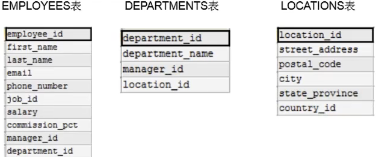

## 笛卡尔积错误

出现错误原因：缺少多表的连接条件

错误出现的实现方式：将每个员工与每个部门都匹配了一遍

```MySQL
SELECT employee_id, department_name
FROM employees, departments;
```

## 正确方式

需要有连接条件

```MySQL
SELECT employee_id, department_name
FROM employees,departments
# 连接条件
WHERE employees.employee_id = departments.department_name;
```


在查询多个表中共有的属性的时候，我们需要明确的支出这个属性属于那个表

```MySQL
SELECT employee_id, department_name, employees.department_id
FROM employees,departments
WHERE employees.employee_id = dempartments.department_name;
```


建议在多表查询的时候，在每个字段前面都加上其所在的表

```MySQL
SELECT employees.employee_id, departments.department_name, employees.department_id
FROM employees,departments
WHERE employees.employee_id = dempartments.department_name;
```


但是在进行多表查询的时候，如果表名太长的话，我们需要些很多遍表明，SQL语句也会变得特别长，这时候我们可以给表起一个别名

```MySQL
SELECT emp.employee_id, dept.department_name, emp.department_id
FROM employees emp,departments dept
WHERE emp.employee_id = dept.department_name;
```


如果我们给表起了别名的话，我们在SELECT和WHERE语句中就一定要使用这个表的别名，否则会出错

如果有n个表实现多表查询，则至少需要n-1个连接条件

练习：查询员工的 employee_id,last_name,department_name,city

```MySQL
SELECT emp.employee_id, emp.last_name, dept.department_name, loca.city
FROM employees emp, departments dept, locations loca
WHERE emp.department_id = dept.department_id 
AND dept.location_id = loca.location_id;
```

## 分类

### 等值连接 VS 非等值连接

只要是WHERE中是=号的是等值连接，如果不是等号的话那么就是非等值连接

等值连接

```MySQL
SELECT emp.employee_id, emp.last_name, dept.department_name, loca.city
FROM employees emp, departments dept, locations loca
WHERE emp.department_id = dept.department_id 
AND dept.location_id = loca.location_id;
```

非等值连接

```MySQL
SELECT e.last_name, e.salary, j.grade_level
FROM employees e, job_grades j
WHERE e.salary BETWEEN j.lowest_sal AND j.highest_sal;
```


### 自连接 VS 非自连接

只要是跟别的表进行连接的话，那就是非自连接

如果是要跟自己连接的话那么就是自连接

自连接

```MySQL
SELECT emp.employee_id, emp.last_name, mgr.employee_id mgr_id, mgr.last_name mgr_name
FROM employees emp, employees mgr
WHERE emp.manager_id = mgr.employee_id;
```


### 内连接 VS 外连接

内连接：只是将满足条件的数据展示出来了，没有满足条件的数据并没有展示

外连接：合并具有同一列两个以上的表的行，结果集中除了包含一个表与另一个表匹配的行之外，

外连接的分类：左外连接，右外连接，满外连接

左外连接:两个表在连接过程中除了返回满足连接条件的行以外还返回左表中不满足条件的行，这种方式称作左外连接

右外连接:两个表在连接过程中除了返回满足连接条件的行以外还返回右表中不满足条件的行，这种方式称作右外连接

练习：查询员工的last_name,department_name的信息,一旦出现所有的话那么就表明这个是外连接

SQL92 实现内连接的方式是：上面所使用的的方式

SQL92 使用(+) 实现外连接 MySQL不支持

```sql
SELECT emp.employee_id, emp.last_name, mgr.employee_id mgr_id, mgr.last_name mgr_name
FROM employees emp, employees mgr
WHERE emp.manager_id = mgr.employee_id(+);
```

SQL99 语法使用 JOIN .... ON的方式实现多表查询，这种方式也能够解决外连接问题

SQL99 实现内连接

```MySQL
# 两张表
SELECT last_name, department_name
FROM employees e JOIN departments d
ON e.department_id = d.department_id;

# 三张表
SELECT last_name, department_name, city
FROM employees e JOIN departments d
ON e.department_id = d.department_id
JOIN locations l
ON d.location_id = l.location_id;
```


SQL99实现内连接

```MySQL
# 左外连接
SELECT last_name, department_name
FROM employees e LEFT OUTER JOIN departments d
ON e.department_id = d.department_id;
# 右外连接OUTER可以省略
SELECT last_name, department_name
FROM employees e RIGHT JOIN departments d
ON e.department_id = d.department_id;
# 满 但是MySQL不支持
SELECT last_name, department_name
FROM employees e FULL JOIN departments d
ON e.department_id = d.department_id;
```


## UNION使用

 合并查询结果 

利用UNION关键字，可以给出多条SELECT语句，并将它们的结果组合成单个结果集。合并时，两个表对应的列数和数据类型必须相同，并且相互对应。各个SELECT语句之间使用UNION或UNION ALL关键字分隔。

语法

```MySQL
SELECT column, ... FROM table1
UNION [ALL]
SELECT column, ... FROM table2;
```


UNION操作符

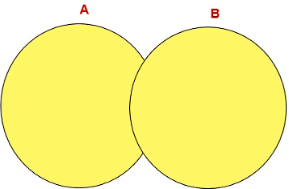

UNION操作符返回两个查询的结果集的并集，去除重复记录

UNION ALL操作符

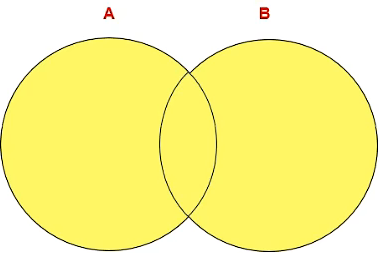

UNION ALL返回两个结果集的并集，对于两个结果集的重复部分，不去重

执行UNIONALL语句时所需要的资源比UNION语句少。如果明确知道合并数据后的结果数据不存在重复数据，或者不需要去除重复的数据，则尽量使用UNION ALL语句，以提高数据查询的效率。


## 7种SQL JOIN的实现

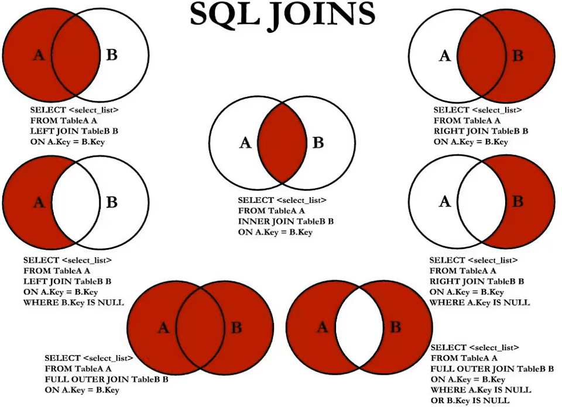


中图：内连接

```MySQL
SELECT e.employee_id, d.department_id
FROM employees e JOIN departments d
ON e.department_id = d.department_id;
```

左上图：左外连接

```MySQL
SELECT e.employee_id, d.department_id
FROM employees e LEFT JOIN departments d
ON e.department_id = d.department_id;
```

右上图：右外连接

```MySQL
SELECT e.employee_id, d.department_id
FROM employees e RIGHT JOIN departments d
ON e.department_id = d.department_id;
```

左中图

```MySQL
SELECT e.employee_id, d.department_id
FROM employees e LEFT JOIN departments d
ON e.department_id = d.department_id
WHERE d.department_id is NULL;
```

右中图

```MySQL
SELECT e.employee_id, d.department_id
FROM employees e RIGHT JOIN departments d
ON e.department_id = d.department_id
WHERE e.department_id is NULL;
```

左下图：满外连接：UNION ALL

方式一：左上图UNION ALL 右中图

```MySQL
SELECT e.employee_id, d.department_id
FROM employees e LEFT JOIN departments d
ON e.department_id = d.department_id
UNION ALL
SELECT e.employee_id, d.department_id
FROM employees e LEFT JOIN departments d
ON e.department_id = d.department_id
WHERE e.department_id is NULL;
```

右下图

左中图 UNION ALL 右中图

```MySQL
SELECT e.employee_id, d.department_id
FROM employees e LEFT JOIN departments d
ON e.department_id = d.department_id
WHERE d.department_id is NULL
UNION ALL
SELECT e.employee_id, d.department_id
FROM employees e LEFT JOIN departments d
ON e.department_id = d.department_id
WHERE e.department_id is NULL;
```


## SQL99新特性

1. 自然连接

   SQL99在sQL92的基础上提供了一些特殊语法，比如NATURAL JOIN用来表示自然连接。我们可以把自然连接理解为sQL92中的等值连接。它会帮你自动查询两张连接表中所有相同的字段，然后进行等值连接

   原始写法

   ```MySQL
   SELECT e.employee_id, d.department_id
   FROM employees e JOIN departments d
   ON e.department_id = d.department_id
   AND e.manager_id = d.manager_id
   ```

   自然连接

   ```MySQL
   SELECT e.employee_id, d.department_id
   FROM employees e NATURAL JOIN departments d
   ```

2. USING

   原始写法

   ```MySQL
   SELECT e.employee_id, d.department_id
   FROM employees e JOIN departments d
   ON e.department_id = d.department_id
   ```

   USING

   当我们进行连接的时候，SQL99还支持使用USING指定数据表里的同名字段进行等值连接。但是只能配合JOIN使用

   ```MySQL
   SELECT e.employee_id, d.department_id
   FROM employees e JOIN departments d
   USING (department_id);
   ```

   


# 单行函数

## 数值函数

基本函数

|          函数           |                             用法                             |
| :---------------------: | :----------------------------------------------------------: |
|         ABS(x)          |                        返回x的绝对值                         |
|         SIGN(x)         |           返回x的符号正数返回1，负数返回-1,0返回0            |
|          PI()           |                        返回圆周率的值                        |
|   CEIL(x),CEILING(x)    |               返回大于或者等于某个值的最小整数               |
|        FLOOR(x)         |                返回小于或等于某个值的最小整数                |
|    LEAST(e1, e2, e3)    |                      返回列表中的最小值                      |
| GREATEST(e1, e2, e3...) |                      返回列表中的最大值                      |
|        MOD(x,y)         |                     返回x除以y之后的余数                     |
|         RAND()          |                       返回0-1的随机值                        |
|         RAND(x)         | 返回0-1的随机值，其中x的值用作种子值<br />相同的x的值会产生相同的随机数 |
|        ROUND(x)         |         返回一个对x值进行四舍五入之后，最接近x的整数         |
|       ROUND(x,y)        | 返回一个对x的值进行四舍五入后最接近x的值，<br />并保留到小数点后面的Y位 |
|      TRUNCATE(x,y)      |                 返回数字x截断为y位小数的结果                 |
|         SQRT(x)         |            返回x的平方根,当x为负数的时候返回NULL             |


角度与弧度互换函数

|    函数    |                 用法                  |
| :--------: | :-----------------------------------: |
| RADIANS(x) | 将角度转化为弧度，其中，参数x为角度值 |
| DEGREES(x) | 将弧度转化为角度，其中，参数x为弧度值 |


三角函数

|    函数    |                             用法                             |
| :--------: | :----------------------------------------------------------: |
|   SIN(x)   |              返回x的正弦值，其中，参数x为弧度值              |
|  ASIN(x)   | 返回x的反正弦值，即获取正弦为x的值。<br />如果x的值不在-1到1之间，则返回NULL |
|   COS(x)   |              返回x的余弦值，其中，参数x为弧度值              |
|  ACOS(x)   | 返回x的反余弦值，即获取余弦为x的值。<br />如果x的值不在-1到1之间，则返回NULL |
|   TAN(x)   |              返回x的正切值，其中，参数x为弧度值              |
|  ATAN(x)   |             返回x的反正切值，即返回正切值为x的值             |
| ATAN2(m,n) |                    返回两个参数的反正切值                    |
|   COT(x)   |                返回x的余切值，其中，X为弧度值                |

